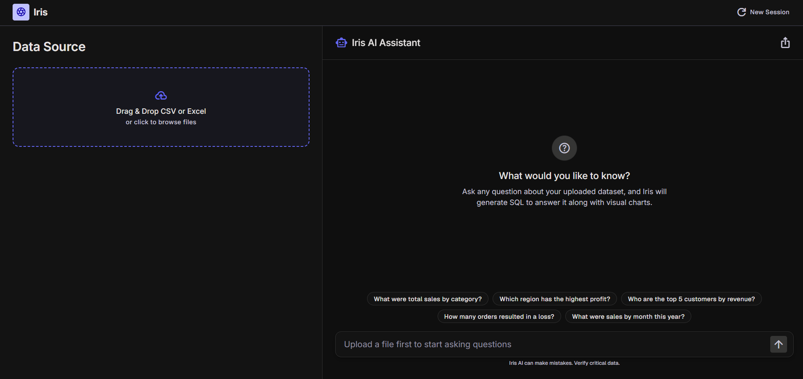

<div align="center">

# 🔮 Iris

### Natural Language Analytics Assistant

*Upload any CSV or Excel file. Ask questions in plain English. Get back a chart, an answer, and the SQL that produced it.*

[](https://iris-pi-seven.vercel.app/)
[](https://github.com/maaz02/Iris)
[-22c55e?style=flat-square)](#evaluation-results)
[](https://python.org)
[](https://react.dev)

</div>

---

## What it does

Most data questions require either writing SQL or waiting for an analyst. Iris removes both barriers.

- **Upload** any CSV or Excel file (.xlsx, .xls) - including non-UTF-8 encoded files
- **Ask** anything in plain English - Iris generates DuckDB SQL using Llama 3.3 70B
- **Get back** a plain-English answer, a visualization (bar, line, pie, table, or single value), and the SQL that produced it - all in one response
- **Explore** with 5 example questions dynamically generated from your actual schema and real data values - not hardcoded placeholders
- **Export** the full session as Markdown or download individual query results as CSV

---

## Demo

> *Upload the Superstore dataset and ask: "What were total sales by region?"*

| Question | Answer | Chart |
|---|---|---|
| What were total sales by region? | West leads with $725K, East with $678K | Bar chart |
| What is the monthly sales trend for 2017? | Sales peak in December at $97K | Line chart |
| Which product category has the highest profit? | Technology at $145K total profit | Bar chart |
| How many drivers are from GBR? | 3 drivers | Table |
| What is the average discount? | 15.62% | Single value |

---

## Evaluation Results

**90% accuracy on a 20-question hand-written eval set** — measured against expected SQL output, not cherry-picked examples.

| Category | Score | Notes |
|---|---|---|
| Aggregation | 3/3 ✅ | SUM, AVG, COUNT all correct |
| Grouping | 4/4 ✅ | GROUP BY across all column types |
| Filtering | 3/4 ⚠️ | 1 failure — see below |
| Time-based | 4/4 ✅ | After DuckDB date syntax fix |
| Ranking | 3/3 ✅ | TOP N queries all correct |
| Combined | 2/2 ✅ | Multi-condition WHERE clauses |

### From 15% → 90%: what actually changed

**Run 1 - 3/20 (15%)**

Three failure categories, all diagnosed:

- **False failures in the eval harness**: comparing column aliases (`total_sales` vs `sum(Sales)`) instead of values - fixed by comparing result values only, position-matched, with 2dp float tolerance
- **DuckDB date syntax errors (4 ERRORs)**: model generating SQLite-style `strftime('%Y-%m', col)` instead of DuckDB's `strftime(col, '%Y-%m')` where the column comes first — fixed by adding explicit DuckDB date rules and 3 few-shot examples to the system prompt
- **Inconsistent aggregate aliasing**: fixed by adding a mandatory aliasing rule to the system prompt

**Run 2 - 18/20 (90%)**

Two remaining failures, both documented as known edge cases:

- **Q8**: model added a redundant `DATEDIFF = 0` condition to a Ship Mode filter — over-interpreted "Same Day" as a date relationship rather than a label value
- **Q10**: used `COUNT()` instead of `COUNT(DISTINCT "Order ID")` — genuinely ambiguous phrasing where both interpretations are valid

Decision: left both as documented edge cases rather than over-fitting the prompt further.

---

## Architecture

```
React + Tailwind + Recharts  (Vercel)
          │
          │ HTTP
          ▼
     FastAPI  (Render)
          │
    ┌─────┴──────────────────────────────────┐
    │                                        │
    ▼                                        ▼
 /upload                                  /ask
 ┌─────────────────────┐      ┌──────────────────────────────┐
 │ Detect encoding      │      │ LLM call 1: question → SQL   │
 │ Read CSV / Excel     │      │ SQL safety validator          │
 │ Load into DuckDB     │      │ DuckDB execution              │
 │ Infer schema         │      │ LLM call 2: rows → answer     │
 │ Return session_id    │      │             + chart spec      │
 └─────────────────────┘      │ Retry on LLM + SQL failures   │
                               └──────────────────────────────┘
                                          │
                                          ▼
                               DuckDB (in-process, per-session)
                                          │
                                          ▼
                               Groq API — Llama 3.3 70B
```

**Why DuckDB?** This is an analytical query tool on single uploaded files — not a multi-user transactional system. An embedded analytical database is the correct engineering choice here, not a shortcut. It reads CSVs and DataFrames directly, runs in-process with no server setup, and handles analytical aggregations efficiently.

---

## Guardrails

- **SQL safety validator**: blocks any non-SELECT query (INSERT, UPDATE, DELETE, DROP, ALTER, multi-statement injection) before execution
- **Retry on execution failure**: if generated SQL fails, sends the error message back to the LLM for one corrected attempt before returning a clean user-facing message
- **Relevance check**: unanswerable questions (no matching schema columns) are declined gracefully before SQL generation is attempted
- **Retry on API failures**: handles 503/429 rate limit responses with backoff before surfacing an error

---

## What I'd improve with more time

**Streaming responses** - currently both LLM calls complete before anything appears. Streaming the plain-English answer while the chart spec is still generating would feel significantly faster.

**Session persistence** - DuckDB sessions live in server memory and are lost on restart. A production version would serialize sessions to disk so users can return to a previous analysis. Render's free tier also cold-starts after inactivity (~30 second first request).

**Histogram chart type** - for dense numeric distributions (like age data), a proper histogram with configurable bin width is more readable than a bar chart with 50+ columns. Currently falls back to table for >20 rows.

**Multi-sheet Excel** - currently uses the first sheet only. A sheet picker would handle files with multiple relevant sheets.

---

## Tech Stack

| Layer | Technology |
|---|---|
| Backend | Python, FastAPI, DuckDB, pandas, chardet |
| LLM | Groq API (Llama 3.3 70B) |
| Frontend | React, Tailwind CSS, Recharts, Vite |
| Infrastructure | Render (backend), Vercel (frontend) |
| Testing | pytest, unittest.mock, custom 20-question eval harness |

---

## Running Locally

**Backend**
```bash
cd iris
pip install -r requirements.txt
echo "GROQ_API_KEY=your_key_here" > .env
uvicorn main:app --reload
```

**Frontend**
```bash
cd frontend
npm install
echo "VITE_API_BASE_URL=http://localhost:8000" > .env
npm run dev
```

**Eval harness** (requires backend running)
```bash
python eval.py
# Results saved to eval/eval_results.json
```

---

<div align="center">

Built by [maaz02](https://github.com/maaz02)

</div>
